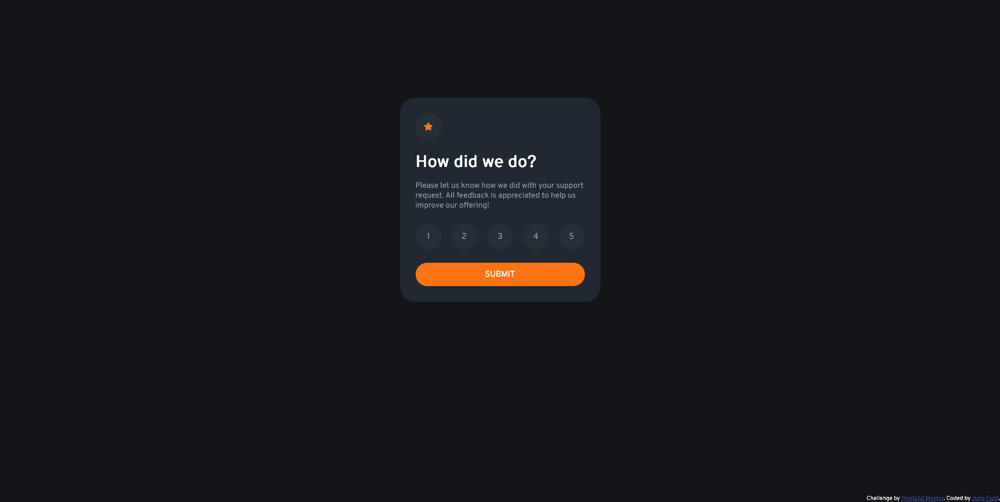
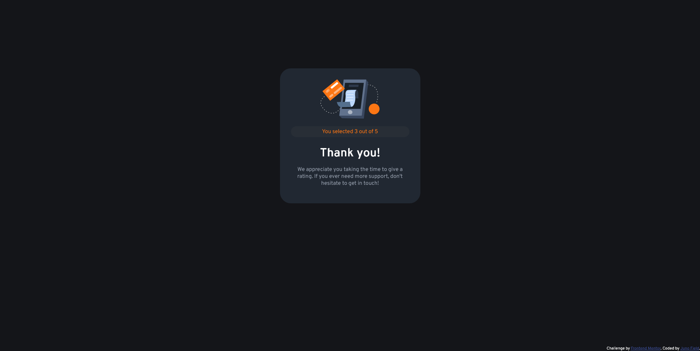

# Frontend Mentor - Interactive rating component solution

This is a solution to the [Interactive rating component challenge on Frontend Mentor](https://www.frontendmentor.io/challenges/interactive-rating-component-koxpeBUmI). Frontend Mentor challenges help you improve your coding skills by building realistic projects. 

## Table of contents

- [Overview](#overview)
  - [The challenge](#the-challenge)
  - [Screenshots](#screenshots)
  - [Links](#links)
- [My process](#my-process)
  - [Built with](#built-with)
  - [What I learned](#what-i-learned)
  - [Continued development](#continued-development)
  - [Useful resources](#useful-resources)
- [Author](#author)
- [Acknowledgments](#acknowledgments)

**Note: Delete this note and update the table of contents based on what sections you keep.**

## Overview

### The challenge

Users should be able to:

- View the optimal layout for the app depending on their device's screen size
- See hover states for all interactive elements on the page
- Select and submit a number rating
- See the "Thank you" card state after submitting a rating

### Screenshots





### Links

- Solution URL: [https://github.com/JunoField/fm1-interactive-rating-component](https://github.com/JunoField/fm1-interactive-rating-component)
- Live Site URL: [https://junofield.github.io/fm1-interactive-rating-component/](https://junofield.github.io/fm1-interactive-rating-component/)

## My process

### Built with

- Semantic HTML5 markup
- CSS custom properties
- Flexbox
- JavaScript HTML DOM
- [Syntatically Awesome Style Sheets](https://sass-lang.com/) - An extensiion for CSS adding additional features.
- [Parcel](https://parceljs.org/) - A build tool and server for HTML, CSS, etc. making testing easy.


### What I learned

As a noob, arguably the most challenging part of this project was the radio buttons. Instead of having a check mark inside the button and a label outside the button, we instead have the label inside the button and have the whole button change colour to indicate a check mark.

```html
  <label class="select-circle" id="circle-one" onclick="handleRad1Change()">1<input type="radio" id="radio-one" name="radio-rating"></label>
```
```css
.select-circle {
    background-color: $circleBgnd;
    width: 50px;
    height: 50px;
    border-radius: 100%;   
    position: relative;
    cursor: pointer;
    text-align: center;
    -webkit-user-select: none;
    -moz-user-select: none;
    -ms-user-select: none;
    user-select: none;
    display: flex; /* or inline-flex */
    align-items: center; 
    justify-content: center;

    input {
        position: absolute;
        opacity: 0;
        cursor: pointer;
        height: 0;
        width: 0;
    }
}
```
The "hover" CSS is simply done on the surrounding label elements (class "select-circle").

Speaking of radio buttons, highlighting the selected one was also difficult. It may have been possible to do this in CSS but I couldn't find out how so I used JS. A bit inefficient, but it worked regardless.

```js
function EnableButtonResetColours(){
    document.getElementById("submit-button").disabled = false;
    document.getElementById("circle-one").classList.remove("select-circle-clicked");
    //...
    document.getElementById("circle-five").classList.remove("select-circle-clicked");
}
//...
function handleRad1Change(){
    EnableButtonResetColours();
    document.getElementById("circle-one").classList.add("select-circle-clicked");
}
```

Git was also somewhat problematic - mostly because I wanted to have the root project folder commit to the master branch and the /dist folder commit to a separate "deploy" branch. This was rather finicky and unreliable - I would like to find a better solution or simply learn how to do it properly.


Finally, I neglected "mobile-first design". I will ensure to do mobile-forst design on all future projects.


## Author

- GitHub - [JunoField](https://github.com/JunoField/)


## Acknowledgments

https://www.w3schools.com/howto/howto_css_custom_checkbox.asp - This was helpful re. the radio buttons.